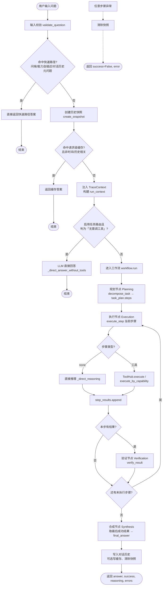
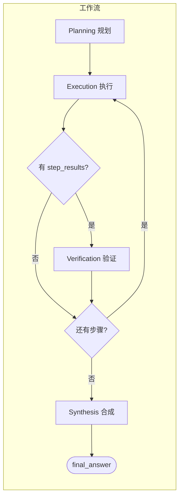

# 用户问题解决全流程 - 流程图

以下 Mermaid 流程图可在支持 Mermaid 的编辑器（如 VS Code/Cursor 插件）中预览，或复制到 [Mermaid Live](https://mermaid.live) 导出为 PNG/JPG。

## 主流程图

## 工作流内部循环（简化）

## 说明

- **快速路径**：问候（你好/hi）、能力自描述（你会什么）、对话历史元问题（上一个问题）→ 不走规划/执行，直接返回。
- **请求级缓存**：同问题重复问且非时间/历史相关时命中，直接返回缓存答案。
- **任务先验路由**：配置 `tools.use_task_router: true` 时，LLM 先判断是否需调工具；若否则直接 LLM 回答。
- **工作流**：规划 → 执行（每步可为直接推理或工具调用）→ 有结果则验证 → 无剩余步骤后合成 → 取最后成功结果作为最终答案。
- **异常**：任一步异常则清除快照并返回 `success: false, error`。
